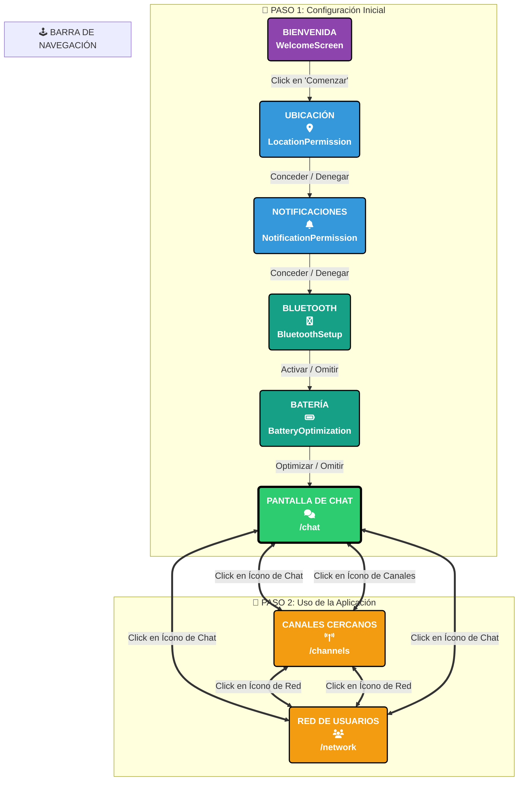

# Mapa Visual de la Aplicación: Evi

Este documento contiene un diagrama de flujo visualmente mejorado que detalla la arquitectura de navegación completa de la aplicación. Es una representación gráfica de cómo un usuario se mueve a través de las diferentes pantallas.

**Instrucción:** Para ver el diagrama, abre este archivo en tu editor de código y utiliza la función de **"Vista Previa" (Preview)**.

## Diagrama de Flujo Profesional

<!-- comentario de prueba -->
